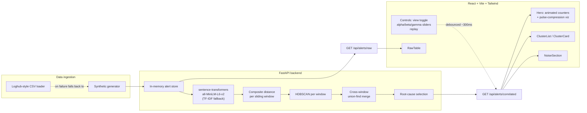

# Nucleus

**An AIOps alert correlation engine.** Built for a hackathon (HPE Synergy 2026)
live demo: it takes a burst of hundreds of raw monitoring alerts, groups the
ones that are really one incident, calls out the most likely root cause per
group, and keeps every suppressed or unclustered alert one click away —
never silently dropped.

---

## The problem

During an infrastructure incident, monitoring systems don't emit one alert —
they emit hundreds, within minutes, on every service downstream of whatever
actually broke. An on-call engineer opens their console to a wall of alerts
that are 90% symptom and 10% signal, and has to manually figure out which
handful of alerts are the actual root cause versus which are just noise
cascading from it.

Nucleus does that grouping automatically:

1. **Cluster** temporally- and semantically-related alerts using a composite
   distance metric + HDBSCAN.
2. **Identify** the most likely root-cause alert per cluster (earliest
   timestamp, severity as tiebreaker) with a one-sentence explanation.
3. **Suppress** the derivative alerts from the primary view — but keep them
   fully inspectable in an expandable list, and never hide unclustered
   "standalone" alerts either.

## Architecture



**Backend** (`backend/`): FastAPI + pandas + scikit-learn + HDBSCAN +
sentence-transformers, in-memory only (no database, per project scope).

**Frontend** (`frontend/`): React 19 + Vite + Tailwind CSS v4, plain
`fetch`/`useState`/`useEffect` (no extra data-fetching library, no
WebSockets — replay mode polls with an advancing `as_of` cutoff instead).

## How the demo works

1. Load the page. The backend has already generated ~800 synthetic alerts
   across 8 simulated incidents plus background noise, embedded them, and
   run the correlation pipeline at its default weights — so the **Hero**
   section renders immediately with a `raw alerts → clusters` animated
   counter and the "pulse compression" visualization: a cloud of dots
   representing raw alerts visibly collapses into a handful of cluster
   markers, while a separate subset of dots (the standalone/noise alerts)
   stays scattered, reinforcing that they were never dropped.
2. **Correlated View** (default tab) shows one card per cluster: the
   root-cause alert highlighted in signal-orange with its one-sentence
   explanation, and a "Show N suppressed alerts" toggle that expands the
   rest of that incident's alerts.
3. Flip to **Raw Stream** to see the flat, unfiltered, chronological alert
   table — the "before" view.
4. Drag the **alpha / beta / gamma** sliders (semantic / temporal /
   service-topology weight) and watch the cluster count, reduction
   percentage, and pulse-compression visualization reshape live (debounced
   ~300ms per request) — this is the interactive centerpiece for judges.
5. Click **Replay Incident** to simulate the alerts arriving live: it
   polls both endpoints with an advancing time cutoff (`as_of`) so the raw
   count climbs and clusters visibly form in real time, over about 16
   seconds.
6. **Standalone alerts** at the bottom of the Correlated View are
   explicitly labeled as unclustered (not suppressed) — HDBSCAN couldn't
   confidently group them with any incident, and the UI never hides that.

### Numbers, honestly

At the default weights, the synthetic scenario collapses **~800 raw alerts
into ~14 clusters** (an ~82% cut), and the bundled real AIOps2020 slice
collapses **675 raw alerts into ~12 clusters** (an ~88% cut) — neither is a
single digit. Moving the sliders visibly trades that number in both
directions, on either source: weighting `alpha` (semantic) higher fragments
incidents into more, tighter-worded sub-clusters; weighting `beta`/`gamma`
(temporal + topology) higher recognizes broader cascades as one incident.
Every number shown in the UI is read directly from `metrics` — nothing is
hardcoded or rounded up for effect.

The default `MIN_CLUSTER_SIZE`/`MIN_SAMPLES`/`CLUSTER_SELECTION_EPSILON`/
`MAX_INCIDENT_SPAN_SECONDS`/weights in `app/config.py` were chosen by
`backend/scripts/tune_reduction.py`, which grid-searches for the highest
reduction_pct that's still *safe on both data sources at once*: on the
synthetic set (validated against its ground-truth incident labels) that
means zero incidents ever merged together and zero clusters fabricated
purely from coincidentally-similar background noise; on the real AIOps2020
slice (no ground truth, so validated structurally) that means zero clusters
spanning more than one real host. Several looser settings scored higher on
synthetic data alone (98%+) but turned out to merge unrelated real hosts
together once checked against the real slice — rejected despite the better
number, because a fabricated or wrong root cause is worse than a lower
reduction percentage. Re-run the script after changing the generator or the
distance metric to re-tune.

## Demo reliability

The live demo must never break on stage, so there are three independent
fallback layers:

- **Data source.** `source=synthetic` (the default) always works — it's a
  pure-Python generator, no I/O. `source=dataset` tries a local raw AIOps2020
  copy (if configured), then the bundled real-data sample, then **falls back
  to the synthetic generator** on any failure, logging a warning rather than
  raising — see below.
- **Embeddings.** If `sentence-transformers` can't load `all-MiniLM-L6-v2`
  (e.g. no internet on first run to fetch the model), the backend falls
  back to a TF-IDF vectorizer instead of crashing. `metrics.embedding_backend`
  always reports which path actually served the request.

### Real data: AIOps2020

`source=dataset` runs on **genuinely real AIOps2020 challenge data**, not a
fabricated fixture, via a threshold-rule alert generator ported from a
companion rule-based prototype that was run directly against a local copy of
the actual dataset:

- `app/data/metric_rules.py` — per-metric thresholds (`CPU_util_pct`,
  `MEM_real_util`, `Sess_Connect`, `DbTime`, ...), each with a severity and
  message, mirroring how a real monitoring system's static alerting rules
  work.
- `app/data/aiops_loader.py` — `generate_from_raw_dataset(root)` scans a local
  dataset copy's metric CSVs (`os_linux.csv`, `db_oracle_11g.csv`, ...keyed by
  `cmdb_id`) and applies those rules to produce alerts in Nucleus's schema.
  Point `NUCLEUS_AIOPS_DATASET_ROOT` at a local copy of the dataset to
  exercise this live.
- `app/data/sample_loghub.csv` — since the full dataset is multi-gigabyte and
  not part of this repo, this bundled fixture is a **real ~675-alert slice**
  (2020-05-27, 18:00–21:00 UTC) of that same rule engine's actual output:
  real `cmdb_id` hosts (`db_008`, `db_013`, ...), real metric values
  (`Sess_Connect=1332`), generated by genuinely running the thresholds above
  against the real dataset. This is what `source=dataset` uses out of the box.
  It flows through the exact same embeddings → composite-distance → HDBSCAN
  pipeline as the synthetic path — e.g. `db_013`'s sustained session-count
  breach collapses ~31 near-duplicate warnings into one root cause.

Two of the original prototype's thresholds (`CPU_util_pct`, `MEM_real_util`)
were miscalibrated for a 0-1 fraction against 0-100-scale readings, which made
them fire on almost any nonzero reading — corrected to a 90 (percent)
threshold in `metric_rules.py`, with the reasoning documented inline. Neither
metric ever actually crosses 90% in this dataset, so the corrected rules
correctly produce zero alerts for them; the bundled slice uses the two
metrics (`Sess_Connect`, `DbTime`) whose original thresholds were already on
the right scale.

`app/data/loghub_loader.py` also accepts any other Loghub-style log corpus
normalized to `timestamp,component,level,message` — drop one at
`app/data/raw/dataset.csv` to take priority over the bundled AIOps2020 slice.

## Setup & run (2 commands, two terminals)

Requires Python 3.9+ and Node 18+.

**Terminal 1 — backend:**

```bash
cd backend && python3 -m venv .venv && source .venv/bin/activate && pip install -r requirements.txt && uvicorn app.main:app --port 8000
```

**Terminal 2 — frontend:**

```bash
cd frontend && npm install && npm run dev
```

Open the printed Vite URL (typically `http://localhost:5173`). The dev
server proxies `/api/*` to `http://127.0.0.1:8000`. API docs are at
`http://127.0.0.1:8000/docs`.

### Sanity check

With the backend running:

```bash
cd backend && source .venv/bin/activate && python scripts/sanity_check.py
```

Hits both endpoints and asserts the response shape matches
[`API_CONTRACT.md`](API_CONTRACT.md) (required fields/types on every alert,
`cluster.size == 1 + len(suppressed)`, `metrics.cluster_count == len(clusters)`,
sliders actually reshape the result, etc). Exits non-zero on any mismatch.

## Repo layout

```
backend/
  app/
    main.py              FastAPI app + endpoints
    config.py             all tunable constants in one place
    schemas.py             Pydantic response models (source of truth for /docs)
    store.py                in-memory cache: load + embed once per source
    data/
      synthetic.py          synthetic incident + noise generator
      service_graph.py       microservice dependency topology
      metric_rules.py         AIOps2020 threshold-rule definitions
      aiops_loader.py          generates alerts from real AIOps2020 metrics
      loghub_loader.py          Loghub-style CSV loader (+ fallback)
      sample_loghub.csv          real ~675-alert AIOps2020-derived slice
    pipeline/
      embeddings.py           sentence-transformers wrapper (+ TF-IDF fallback)
      distance.py              composite distance matrix
      windows.py                sliding time windows
      clustering.py             HDBSCAN + cross-window merge + root cause + metrics
  scripts/
    sanity_check.py
    tune_reduction.py       grid-search for config.py's clustering knobs
  requirements.txt
frontend/
  src/
    App.jsx               state, data fetching, replay-mode timer
    api.js                  fetch wrappers
    format.js                 shared formatting helpers
    components/
      Header.jsx, Hero.jsx, PulseCompression.jsx, Controls.jsx,
      ClusterList.jsx, ClusterCard.jsx, RawTable.jsx, NoiseSection.jsx, AlertRow.jsx
  package.json
API_CONTRACT.md
README.md
```

## Quality notes for reviewers

- **Root-cause heuristic** is one sentence, generated per-cluster and shown
  in the UI (`cluster.explanation`), not a generic label.
- **Composite distance** components (`semantic_distance`, `temporal_distance`,
  `service_penalty`) are each independently normalized to `[0, 1]` before
  weighting, so alpha/beta/gamma are directly comparable knobs — see the
  docstring in `app/pipeline/distance.py`.
- **Sliding windows** overlap (step < window) specifically so an incident
  straddling a window boundary still gets clustered whole; cross-window
  merges are additionally capped by `MAX_INCIDENT_SPAN_SECONDS` so a long
  chain of coincidentally-similar background noise can't transitively bridge
  two unrelated incidents into one (see `app/pipeline/clustering.py`).
- Every tunable constant (window size, HDBSCAN parameters, default weights,
  synthetic generator sizing) lives in `app/config.py` with a comment
  explaining *why* it's set the way it is.
