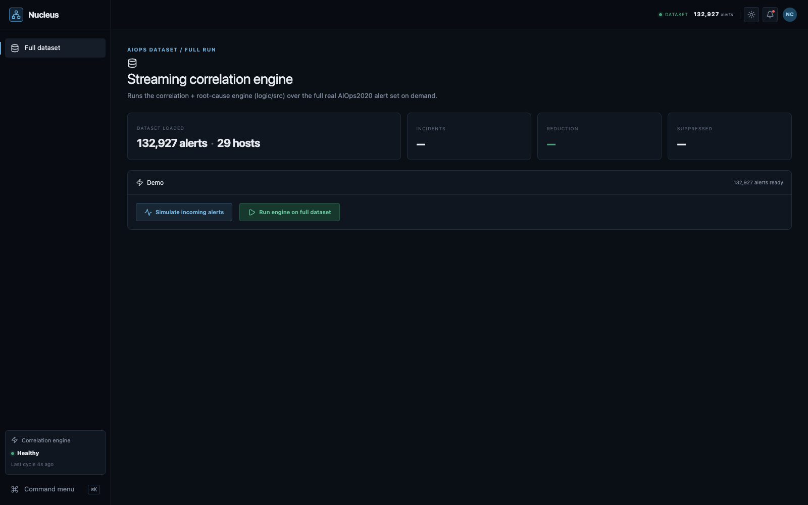
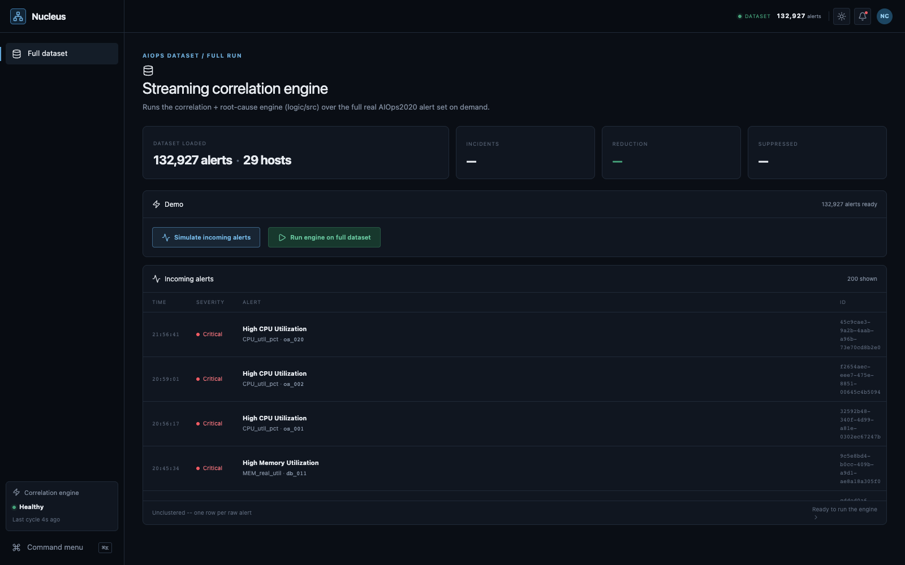
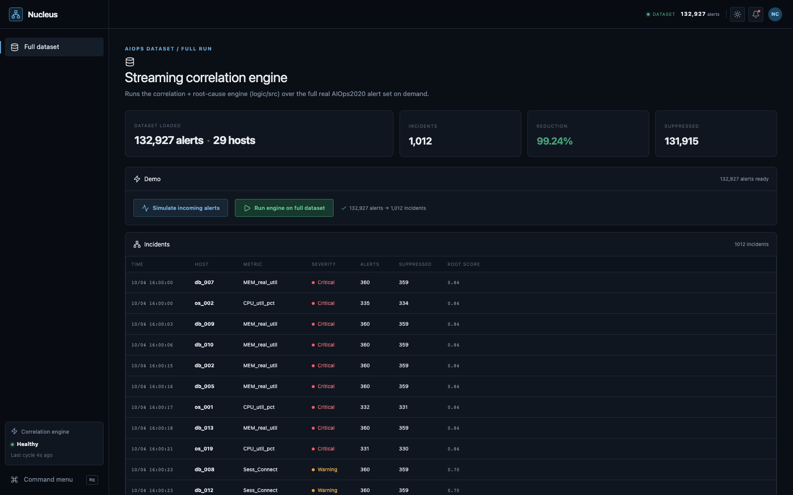
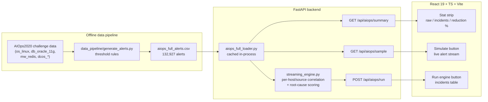

<div align="center">

# Nucleus

**Turn 130,000 raw monitoring alerts into 1,012 actionable incidents.**

*Built for HPE Synergy Hackathon 2026*

[](https://frontend-xi-orpin-21.vercel.app)
[-1baf7a?style=for-the-badge)](#the-dataset)
[](#results-honestly)

</div>

---

## The problem

During a real infrastructure incident, monitoring systems don't emit one
alert — they emit hundreds or thousands, within minutes, on every service
downstream of whatever actually broke. An on-call engineer opens their
console to a wall of alerts that's 90% symptom and 10% signal, and has to
manually work out which handful are the actual root cause versus which are
just noise cascading from it.

**Nucleus does that triage automatically**, and it does it on a real,
public incident dataset — not a synthetic toy — so the numbers below are
real correlation results, not a demo script.

<table>
<tr>
<td width="33%" align="center"><br><sub><b>1. Dataset loaded</b> — 132,927 real alerts, 29 hosts</sub></td>
<td width="33%" align="center"><br><sub><b>2. Simulate</b> — alerts stream in live, unclustered</sub></td>
<td width="33%" align="center"><br><sub><b>3. Run engine</b> — collapses to 1,012 incidents</sub></td>
</tr>
</table>

## Table of contents

- [How the demo works](#how-the-demo-works)
- [Architecture](#architecture)
- [Results, honestly](#results-honestly)
- [The dataset](#the-dataset)
- [Tech stack](#tech-stack)
- [Quickstart](#quickstart)
- [API reference](#api-reference)
- [Repo layout](#repo-layout)
- [Deployment](#deployment)
- [What's next](#whats-next)

## How the demo works

Open the app and you land straight on the **Streaming correlation engine**
view — no login, no config, no sample-vs-real toggle to get lost in. It's
one dataset, one story, two buttons:

<details open>
<summary><b>1. Simulate incoming alerts</b></summary>
<br>

Streams a live sample of real alerts from the dataset onto the screen, one
by one — timestamp, severity, message, host, ID. This is the "before":
raw, unclustered, exactly what an on-call engineer's console looks like
mid-incident.
</details>

<details open>
<summary><b>2. Run engine on full dataset</b></summary>
<br>

Runs the actual streaming correlation + root-cause engine over **all
132,927 alerts** (not a sample) and replaces the flood with the reduced
result: incident count, reduction %, suppressed count, and a sortable table
of every incident with its root-cause host, metric, severity, and
confidence score.
</details>

Click Simulate again and it resets — replay it as many times as a judge
wants to see it.

## Architecture



**Backend** (`backend/`): FastAPI, in-memory + on-disk CSV only — no
database. The correlation engine (`app/streaming_engine.py`) is a
pure-function rewrite of an original prototype — same algorithm, adapted
to run inside a request handler instead of a standalone script.

This diagram covers the production request path only. There's also an
independent AI preprocessing pipeline (embeddings + composite distance,
preparing for future clustering) that reads through the same loader but
never touches the correlation engine above — see
[`docs/ARCHITECTURE.md`](docs/ARCHITECTURE.md) for how all three layers
(offline / production / AI) relate.

**Frontend** (`frontend/`): React 19 + TypeScript + Vite + Tailwind CSS v4 +
Zustand, plain `fetch` (no extra data-fetching library, no WebSockets).

An earlier iteration also had a second correlation approach — semantic
embeddings (sentence-transformers) + HDBSCAN clustering over a small
synthetic/sample dataset. It was cut from this repo: it never ran against
the real dataset, doubled the dependency footprint (`torch` alone was
most of the Render deploy failures), and wasn't reachable from the UI. The
streaming engine below is the one thing this repo does, done against real
data end to end.

## Results, honestly

Every number below is read live from the engine's own output — nothing
hardcoded, nothing rounded up for effect:

| Metric | Value |
|---|---|
| Raw alerts processed | **132,927** |
| Incidents identified | **1,012** |
| Alerts suppressed as noise | **131,915** |
| Reduction | **99.24%** |
| Hosts covered | **29** (`os_*` Linux hosts, `db_*` Oracle hosts) |
| End-to-end runtime | **~60-90 seconds** locally (single-pass correlation is fast; root-cause scoring is the dominant cost) |
| Dataset span | ~50 days (2020-04-10 → 2020-05-30) |

The engine correlates alerts per `(host, source)` using a sliding
time-gap + metric + severity + value-delta score
(`CORRELATION_THRESHOLD = 0.60`, incidents expire after 10 minutes of
inactivity), then scores every alert in an incident for root-cause
likelihood — severity (35%), how early it fired relative to the incident
(25%), how common its metric is within the incident (20%), and a fixed
metric-priority table (20%, CPU > memory > disk > network) — and picks the
highest-scoring alert as the root cause.

## The dataset

This isn't synthetic. `aiops_full_alerts.csv` is generated by
`data_pipeline/generate_alerts.py` (the offline data pipeline — see
[`docs/ARCHITECTURE.md`](docs/ARCHITECTURE.md)) applying threshold rules
(defined in that same file) to the real **AIOps2020 Challenge** dataset's platform
metrics — genuine `os_linux.csv` / `db_oracle_11g.csv` / `mw_redis.csv` /
`dcos_docker.csv` / `dcos_container.csv` readings, keyed by real
`cmdb_id` hosts. The raw metric files are multi-gigabyte and aren't part
of this repo — what's bundled is the already-materialized 132,927-alert
output of running those rules, which is what the engine actually runs on.

## Tech stack

<table>
<tr><td><b>Backend</b></td><td>

`FastAPI` · `pandas` · `uvicorn` · `pydantic` — four dependencies, no ML
runtime, no database

</td></tr>
<tr><td><b>Frontend</b></td><td>

`React 19` · `TypeScript` · `Vite` · `Tailwind CSS v4` · `Zustand` ·
`Framer Motion` · `lucide-react`

</td></tr>
<tr><td><b>Data</b></td><td>

Real AIOps2020 Challenge dataset (platform metrics), threshold-rule
alert generation, no synthetic fixtures in the primary demo path

</td></tr>
<tr><td><b>Deploy</b></td><td>

Frontend on Vercel · Backend targets Render (`render.yaml` blueprint
included)

</td></tr>
</table>

## Quickstart

Requires Python 3.9+ and Node 18+.

**Terminal 1 — backend:**

```bash
cd backend
python3 -m venv .venv && source .venv/bin/activate
pip install -r requirements.txt
uvicorn app.main:app --port 8000
```

**Terminal 2 — frontend:**

```bash
cd frontend
npm install
npm run dev
```

Open the printed Vite URL (typically `http://localhost:5173`). The dev
server proxies `/api/*` to `http://127.0.0.1:8000`. Interactive API docs
are auto-generated at `http://127.0.0.1:8000/docs`.

## API reference

The live demo runs on three endpoints:

| Endpoint | Method | Description |
|---|---|---|
| `/api/aiops/summary` | `GET` | Cheap metadata — total alert count + host count. Used to populate the stat strip without shipping the whole dataset. |
| `/api/aiops/sample?limit=220` | `GET` | A random sample of individual raw alerts, chronologically sorted — powers the "Simulate incoming alerts" animation. |
| `/api/aiops/run` | `POST` | Runs the full correlation + root-cause engine over all 132,927 alerts. Returns every incident (host, root metric, severity, root-cause alert, confidence score, alert/suppressed counts) plus aggregate metrics. Takes ~60-90s locally — it's a real computation, not a canned response. |

See [`docs/API_CONTRACT.md`](docs/API_CONTRACT.md) for the full request/response contract.

## Repo layout

See [`docs/ARCHITECTURE.md`](docs/ARCHITECTURE.md) for how these three layers
(offline data pipeline / production correlation engine / AI preprocessing
pipeline) relate to each other.

```
backend/
  app/
    main.py                    FastAPI app + all endpoints
    schemas.py                 Pydantic response models
    aiops_full_loader.py       shared loader -- both pipelines below read through this
    streaming_engine.py        production layer: the correlation + root-cause engine
    embeddings.py              AI layer: text -> sentence-transformer embeddings
    distance.py                AI layer: semantic/temporal/host + composite distance
    preprocessing.py           AI layer: orchestrates embeddings.py + distance.py, stores/summarizes results
    data/
      aiops_full_alerts.csv    the 132,927-alert real dataset
      demo_sample_*.csv        fixed graduated demo slices
  requirements.txt             fastapi, uvicorn, pydantic, pandas, numpy, scikit-learn, sentence-transformers
frontend/
  src/
    App.tsx                    the whole UI
    useOpsStore.ts             Zustand store -- state + API calls
    api.ts                     fetch wrappers + shared types
data_pipeline/
  generate_alerts.py           offline layer: real AIOps2020 metrics -> aiops_full_alerts.csv
                                (threshold rules + generator, one-time data-prep
                                script -- not called by the running app)
  data/, outputs/               generated CSVs (gitignored, reproducible via the script above)
docs/
  ARCHITECTURE.md               the three layers, how they relate, diagrams
  API_CONTRACT.md              full request/response contract
  screenshots/                 the three screenshots at the top of this README
render.yaml                    Render deployment blueprint
README.md
```

## Deployment

- **Frontend** — live on Vercel: **https://frontend-xi-orpin-21.vercel.app**
- **Backend** — live on Render: **https://nucleus-backend-agvp.onrender.com**
  (`render.yaml` blueprint, plan: free). `VITE_NUCLEUS_API_URL` is set on
  the Vercel project, so the two are connected — the live frontend talks
  to the live backend, not just localhost.

**Known caveat:** `POST /api/aiops/run` takes ~60-90 seconds locally but
**considerably longer on Render's free tier** — the correlation loop is a
single-threaded Python pass over 132,927 rows, and the free tier's shared
CPU is heavily throttled compared to a real machine. The result is
byte-for-byte identical either way (verified), it's just slow. For a live
judged demo, click "Run engine" *before* you start talking, or use the
[Quickstart](#quickstart) locally — the free tier is fine for "the deploy
works," not for "watch it run live in seconds." Upgrading the Render
plan would fix this if it matters more than the hackathon budget.

## What's next

- Wire `VITE_NUCLEUS_API_URL` once the backend is deployed, so the live
  Vercel frontend talks to a live backend instead of only working
  locally.
- Persist engine runs somewhere queryable (currently CSV/in-memory only)
  if this moves beyond a demo — a real deployment would want Postgres for
  the incident table and, if the raw alert volume keeps growing,
  something time-series-shaped for the firehose.
