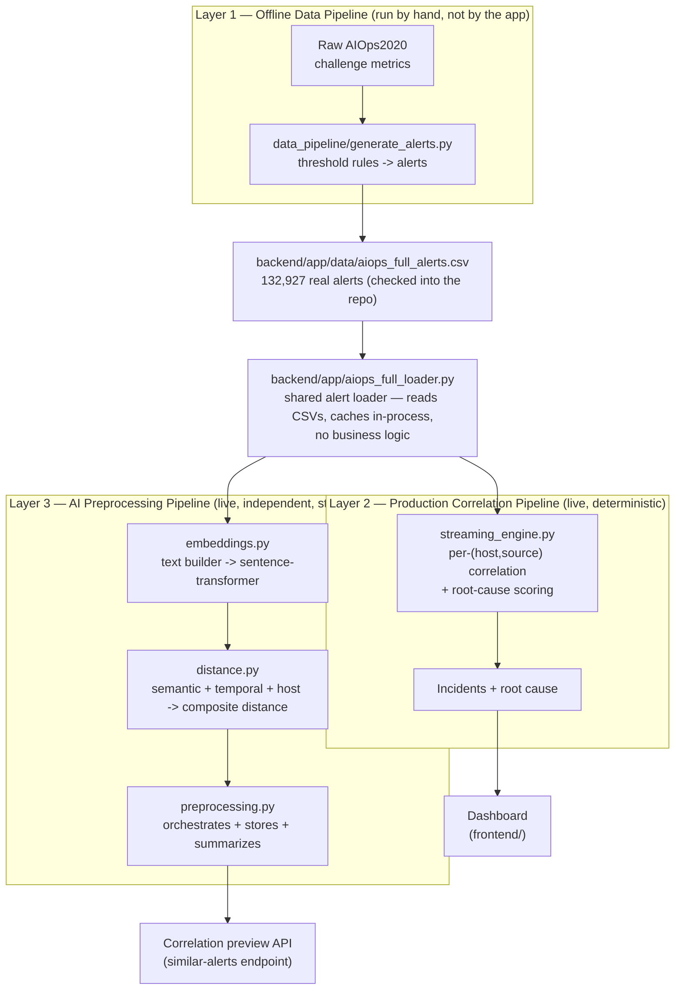

# Architecture

Nucleus is three independent layers that happen to share one dataset. They
don't call each other, and none of them needs the others to run. This
document exists to make that separation explicit — especially the boundary
between the deterministic production engine (what the dashboard actually
runs) and the newer AI preprocessing pipeline (which currently does nothing
the dashboard depends on, and is deliberately built that way).



## Layer 1 — Offline Data Pipeline

**`data_pipeline/generate_alerts.py`**

Converts raw AIOps2020 challenge telemetry (`os_linux.csv`, `db_oracle_11g.csv`,
`mw_redis.csv`, `dcos_docker.csv`, `dcos_container.csv` — multi-gigabyte, not
in this repo) into alerts, by applying a fixed threshold table (`ALERT_RULES`,
in the same file — e.g. `CPU_util_pct > 0.90 → Critical`). Run by hand,
offline, once. Its only output that matters at runtime is already checked
into the repo: `backend/app/data/aiops_full_alerts.csv`.

Nothing in `backend/` or `frontend/` imports this file. It lives in its own
top-level folder specifically so that's obvious without reading any code —
`data_pipeline/` is data-prep tooling, `backend/`/`frontend/` is the app.

## Layer 2 — Production Correlation Pipeline

**`backend/app/streaming_engine.py`** — unchanged by this refactor, and by
design, this is the *only* thing the dashboard's "Run Nucleus" and "AIOps
Dataset" views ever call.

```
alerts (sorted by timestamp)
        ↓
group by (host, source), single pass
        ↓
score each new alert against active incidents for that (host, source)
        ↓
join if score ≥ CORRELATION_THRESHOLD (0.60), else start a new incident
        ↓
incidents expire after INCIDENT_TIMEOUT_SECONDS (10 min) of inactivity
        ↓
root-cause score per incident member:
  severity (35%) + how early it fired (25%) + metric frequency (20%) + metric priority (20%)
        ↓
{ incidents, metrics: { raw_count, incident_count, reduction_pct, ... } }
```

Deterministic, no ML, no embeddings, no I/O beyond reading the CSV through
the shared loader. This is intentionally the simplest possible thing that
produces a correct, explainable result — and it stays exactly as-is.

## Layer 3 — AI Preprocessing Pipeline

**`backend/app/embeddings.py` → `distance.py` → `preprocessing.py`**

Recovered from git history (was deleted as unreachable dead code, then
restored and adapted once it became relevant again — see git log on these
files for that history) and adapted for this dataset. Computes everything a
clustering step would need, then **stops**:

```
alerts
        ↓
embeddings.alert_to_text()      -- one natural-language sentence per alert,
        ↓                          built from host/metric/severity/value/message
embeddings.embed_messages()     -- sentence-transformers/all-MiniLM-L6-v2
        ↓                          (TF-IDF fallback if the model can't load)
distance._semantic_distance_matrix()   -- cosine distance between embeddings
distance._temporal_distance_matrix()   -- normalized time-gap distance
distance._host_distance_matrix()       -- graded: same host < same Oracle
        ↓                                  cluster < same Linux cluster < cross-type
distance.composite_distance_matrix()   -- α·semantic + β·temporal + γ·host
        ↓
preprocessing.run_preprocessing()      -- stores the full result in-memory,
        ↓                                  returns a summary + id
STOP — no clustering happens here
```

Exposed via `POST /api/aiops/preprocess` and inspected via
`GET .../preprocess/{id}`, `.../matrices`, and `.../similar/{alert_id}` (the
correlation-preview endpoint — "what would this alert most likely be grouped
with"). None of this feeds into `streaming_engine.py`, and none of it is
called by the current dashboard views. It exists to be ready, not to be used
yet.

## The shared alert loader

**`backend/app/aiops_full_loader.py`**

Both pipelines above call `load_demo_sample(size)` / `load_full_dataset()`
independently and get back the same plain `pandas.DataFrame`. This file's
job stops at "read CSVs, cache them in-process" — it has no opinion about
correlation, embeddings, or distance, and doesn't import from either
pipeline. That's what keeps Layer 2 and Layer 3 from depending on each other
transitively through the loader.

```
                    aiops_full_loader.py
                            │
                ┌───────────┴───────────┐
                ▼                       ▼
      streaming_engine.py      embeddings.py / distance.py
      (Layer 2, production)    (Layer 3, AI preprocessing)
```

## Future compatibility — where HDBSCAN plugs in

Layer 3 was built to stop at exactly the interface HDBSCAN needs:
`composite_distance_matrix()` already returns an `(n, n)` array shaped for
`hdbscan.HDBSCAN(metric="precomputed").fit_predict(distance_matrix)`. Adding
clustering later means a **new** module consuming that output — it does not
mean reopening `embeddings.py` or `distance.py`:

```
Alert Loader
        │
        ▼
AI Preprocessing (embeddings.py → distance.py → preprocessing.py)
        │
        ▼
Composite Distance Matrix          ← already exists today, unchanged
        │
        ▼
HDBSCAN                             ← new module, not yet built
        │
        ▼
Incident Clusters
```

## Quick reference

| File | Layer | Responsibility |
|---|---|---|
| `data_pipeline/generate_alerts.py` | Offline | Raw metrics → `aiops_full_alerts.csv`. Run by hand, not by the app. |
| `backend/app/aiops_full_loader.py` | Shared | Reads/caches alert CSVs. No correlation or ML logic. |
| `backend/app/streaming_engine.py` | Production | Deterministic correlation + root-cause scoring. What the dashboard runs. |
| `backend/app/embeddings.py` | AI | Alert text → sentence-transformer embeddings. |
| `backend/app/distance.py` | AI | Semantic/temporal/host distance → composite distance matrix. Pure numpy, no FastAPI. |
| `backend/app/preprocessing.py` | AI | Orchestrates embeddings + distance, stores results, builds summaries and the correlation-preview. |
| `backend/app/main.py` | — | Wires both Layer 2 and Layer 3 to HTTP endpoints. The only file that knows both pipelines exist. |
